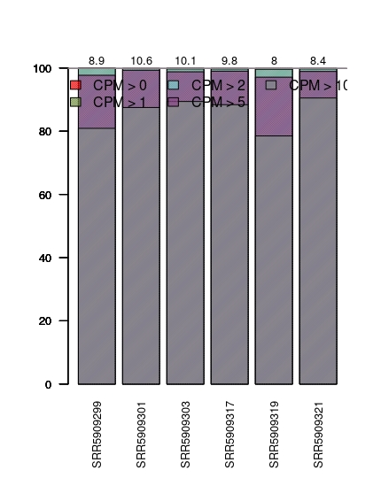

# gamergates_project
Progetto per il laboratorio di genomica comparata.

L'idea dietro questo progetto sarebbe quello di replicare uno studio condotto su una specie di formiche con struttura sociale divisa in caste. La specie in questione riesce a prolungare la vita della colonia anche alla morte della regina. Alcuni individui, definiti come gamergates, diventano ovodepositori e mostrano i tipici comportamenti da regina, molto differenti da quelli di raccolta delle altre operaie. È riconoscibile una trascrizione differenziale tra individui di caste differenti (gamergates/workers), in particolare di una proteina, la corazonina.

Inoltre, studi di caso e controllo tramite l'iniezione di questa proteina hanno dimostrato che le formiche iniettate manifestano comportamenti da operaia, quale anche una propensione per la ricerca del cibo. La corazonina quindi è in grado di fare lo shift verso la casta operaia. Al contrario, in individui con bassi livelli di corazonina (ma non solo), presentano alti livelli di un altra proteina, la vitellogenina.

Il discorso è molto più lungo e complicato di così, per cui rimando all'articolo: ***https://doi.org/10.1016/j.cell.2017.07.014***

Quello che ho cercato di fare è un'analisi di trascrizione differenziale tra operaie e regina di Harpegnathos saltator, utilizzando gli stessi dati del paper di cui parlo sopra. 

### SAMPLE

Sample | SRA |
------ | --- | 
workers,120d | SRR5909317 |
workers,120d | SRR5909319 | 
workers,120d | SRR5909321 | 
queens, 120d | SRR5909303 |
queens, 120d | SRR5909301 | 
queens, 120d | SRR5909299 |

### Download and check fastq file
Ho scaricato le reads da NCBI prendendo i codici SRA dal paper (quelli in tabella qua sopra). Poi le ho validate utilizzando la cartella che viene scaricata automaticamente con `fastq-dump`. In più per ogni campione è stata fatta l'analisi utilizzando fastqc.
```download
fastq-dump --defline-seq '@$sn[_$rn]/$ri' <SRACODE>
```
```check
vdb-validate ~/ncbi/public/sra/*.sra
```
```create an apposite directory and move all the fastq file there
if [ -d fastq ]
  then rm -r fastq
  fi
  
mkdir fastq  
mv *.fastq fastq/.
```  
```create the directory and perform the fastqc analyses
mkdir fastqc
cd fastqc
fastqc ../fastq/*.fastq -o fastqc
```

### Trimming
Le reads sono state trimmate e poi analizzate con fastqc, per vedere quanto erano migliorate con il trimming. I risultati si possono vedere [qui.](https://github.com/die-lab/gamergates_project/tree/main/fastqc)
```create the directory for storing trimmed reads
if [ -d trimmomatic ]
  then rm -r trimmomatic
  fi
  
mkdir trimmomatic  
```
```trim
cd fastq/.

for fastq in *.fastq
  do /usr/local/anaconda3/share/trimmomatic-0.39-2/trimmomatic SE -threads 5 -phred33 $fastq ../trimmomatic/${fastq%.fastq}.trim.fastq ILLUMINACLIP:/usr/local/anaconda3/share/trimmomatic-0.39-2/adapters/TruSeq3-SE.fa:2:30:10 LEADING:3 TRAILING:3 SLIDINGWINDOW:4:15 MINLEN:75 2>>../trimmomatic/stats_trimmomatic
  done
  
cd ../.  
```
```fastqc of trimmed reads
cd ~/project
fastqc trimmomatic/*.trim.fastq -o fastqc
```
In effeti le raw reads scaricate da NCBI non erano un granchè. In particolare erano quasi allarmanti i valori di *per base sequence content* e di *per sequence GC content*. Sono invece meno problematici i brutti score ottenuti nelle voci di *overrapresented sequence* e di *adapter content*. Essendo le raw reads ancora da trimmare e quindi con gli adapter, è normale trovare sequenze sovrarappresentate. Come dice pure fastqc nella sua analisi, la più probabile origine di quei brutti valori sono gli adapter, non ancora tagliati via da trimmomatic. Passando ai fastqc delle reads trimmate, i valori sono più buoni. Mentre in generale la voce *per sequence GC content* è migliorata, e sono spariti i picchi che le caratterizzavano (e che le rendevano "brutte"), il valore *per base sequence content* in alcuni casi sembra essere peggiorato. Potrebbe anche essere che sia stato fastqc a riconoscerlo come peggiorato quando non lo è. Graficamente infatti si vede una minore oscillazione dei valori. l'*adapter content* è positivo per tutti i campioni, una volta trimmati, il che significa che gli adapters sono stati riconosciuti e tagliati correttamente. Il *seqeunce duplication levels* da, per tutti i campioni (sia per i fastqc deille raw reads che per quelli trimmati), un warning o un failure. Questo potrebbe derivare dalla presenza di un contaminante o da un bias nel sequenziamento. Sembra che questo errore sia abbastanza comune, soprattutto nelle library da RNA-seq per trascrizione differenziale, ma anche per altri motivi, quindi non ci ho dato tropppo peso. Dei campioni trimmati solamente uno (SRR5909319) mostra una *overrapresented sequence*. Anche in questo caso non mi sono preoccupato, essendo presente in un solo campione su sei. Fastqc non è riuscito ad individuare l'origine di questa sequenza sovrarappresentata, come invece riusciva a fare per gli adapter nell'analisi dei raw reads. Anche in questo caso però credo si tratti di un adapter, che probabilmente non è stato riconosciuto come tale perchè il match tra questo e uno di riferimento stava sotto ad una certa soglia. 

Sample | SRA | RawReads | Trimmed | Surviving |
------ | --- | -------- | ------- | --------- | 
workers,120d | SRR5909317 | 21626186 | 14108660 | 0.65 | 
workers,120d | SRR5909319 | 16669963 | 11135596 | 0.67 |
workers,120d | SRR5909321 | 17764503 | 12087966 | 0.68 |
queens, 120d | SRR5909303 | 22630380 | 15362292 | 0.68 |
queens, 120d | SRR5909301 | 22593965 | 15206110 | 0.67 |
queens, 120d | SRR5909299 | 20493983 | 12306915 | 0.60 |

### Trinity
Sono passato quindi alla fase di assemblaggio del trascrittoma. Essendoci relativamente poche sequenze, o perlomeno file fastq con una dimensione accettabile, ho fatto partire l'analisi di Trinity senza prima fare il subsampling. Sarebbe stato meglio avere più campioni e di questi prenderne solamente una parte, così da avere delle sequenze più rappresentative. Putroppo però i campioni erano solamente questi qui.
```create the directory for running, and storing, Trinity output.
if [ -d trinity ]
  then rm -r trinity
  fi

mkdir trinity
cd trinity 
```
```automatic trinity
list=$(ls ../trimmomatic/*.fastq)
echo $list > lista
sed -i 's/ /,/g' lista
file=$(cat lista)

Trinity --seqType fq --single $file --CPU 6 --max_memory 20G

#serve per pulire la cartella di trimmomatic da nuovi file.
mkdir trimmed_readcount
cd trimmed_readcount
mv ../../trimmomatic/*.readcount .
cd ..
```
 #### Checking trinity output
 Prima di tutto è stata fatta una RNA-seq read rapresentation dell'assemblaggio. Le statistiche dell'allineamento, visibili qui, non sono male. Meno del 9% delle reads da cui si è ottenuto l'assemblaggio non mappano sull'assemblaggio stesso. 
 ```
  cd /home/STUDENTI/diego.carli/project/trinity/trinity_out_dir/.
  mkdir checking
  cd checking
  ```
  ```
  bowtie2-build ../Trinity.fasta trinity_fasta
  cat ../../../trimmomatic/*.fastq > all_reads.fastq
  bowtie2 -p 10 -q --no-unal -k 20 -x trinity_fasta -U all_reads.fastq 2>align_stats.txt| samtools view -@10 -Sb -o bowtie2.bam 
  
  rm all_reads.fastq
  cd ..
 ```
  Poi si fanno un po' di statistiche. Dal file [trinity_check.txt](https://github.com/die-lab/gamergates_project/blob/main/trinity/trinity_out_dir/checking/trinity_check.txt) vengono mostrate alcune statistiche molto utili, come ad esempio l'N50, che raggiunge un valore abbastanza buono, sia considerando tutti i "geni", ovvero i contig trovati, che considerando solamente le isoforme più lunghe. 
 ```
 TrinityStats.pl Trinity.fasta > trinity_check.txt
 ```
 Poi gli assemblaggi sono stati caricati su gVolante  per l'analisi della qualità. LQuesta analisi è stata ripetuta più volte, settando diversamente i parametri.
 Per vedere i risultati andare alla pagina dedicata ed inserire il job ID (questo qui sotto, ma senza "ID").
 
 * ID 202106031822-6R7ADFXGD3F82VXR. sequence type: trans, program: Busco1, Reference_gene_set: Arthropoda
 * ID 202106031921-GV3JR6CZ26AAZKMX. sequence type: trans, program: Busco2-3, Reference_gene_set: Arthropoda

È evidente che l'analisi con Busco,v2-v3 è molto più soddisfacente rispetto a Busco,v1.
Probabilmente dipende dal tipo di set di geni ortologhi nella quale questi programmi fanno la ricerca. Busco,v2-v3 essendo stato rilasciato dopo, avrà probabilmente un dataset più grande e più aggiornato. Con solamente 26 gebi core mancanti secondo l'analisi di gVolante più promettente, penso si possa considera l'assemblaggio come buono. 

#### Isoform redundancy
Ho utilizzato Cd-hit perchè abbiamo visto che non necessariamente l'isoforma più lunga, che trovava lo script in perl di trinity per ridurre le isoforme, era quella più corretta . Vado allora con CD-HIT, che però vuole un file formattato diverso da quello che esce da trinity. Il file [cd_hit.log](https://github.com/die-lab/gamergates_project/blob/main/trinity/trinity_out_dir/cd_hit.log) da alcune informazioni sulla corsa di cd-hit-est.
```modifico l'header e metto la sequenza su una sola riga usando lo script di Mariangela
sed -i 's/ len=.\+//g' Trinity.fasta
cp /home/STUDENTI/diego.carli/didattica-main/2_bash_scripting/scripts/oneline_fasta.sh .
sh oneline_fasta.sh Trinity.fasta
```
```
cd-hit-est -i Trinity.fasta -o output.fasta -T 12 -t 1 -c 0.9
```
A questo punto non ero sicuro di cosa ci fosse nei due file di output di `cd-hit-est`. Inizialmente pensavo che da una parte, in [output.fasta](https://github.com/die-lab/gamergates_project/blob/main/trinity/trinity_out_dir/output.fasta), ci fossero solamente le reads rappresentative, mentre in [output.fasta.clstr](https://github.com/die-lab/gamergates_project/blob/main/trinity/trinity_out_dir/output.fasta.clstr) ci fossero tutti i diversi cluster. Ciò non mi torna però perchè se greppo ">" in entrambi i file mi danno un numero molto diverso di righe. Dovrebbero infatti avere, questi due file, lo stesso numero di "sequenze", con da una parte solamente la sequenza rappresentativa dopo l'header con >, e dall'altra l'header, ossia il numero di cluster, indicato con >, seguito da un numero variabile di righe che mi indicano quali reads sono state abbinate a quel cluster. Riassumendo, pensavo ci fosse una sequenza rappresentativa per ogni cluster, ma invece non è così (il numero di cluster è molto più alto), e non ne ho capito il motivo. 

### Diamond
Sono passato quindi all'annotazione. Per prima cosa devo costruire il database che userà Diamond. I due file in uscita da queste annotazioni sono rispettivamente [ouptup](https://raw.githubusercontent.com/die-lab/gamergates_project/main/diamond/ouptup) e [out.tsv](https://raw.githubusercontent.com/die-lab/gamergates_project/main/diamond/out.tsv). Il secondo di questi, oltre ad avere una formattazione diversa rispetto al primo, presenta più sequenze riconosciute come ortologhe, pur utilizzando lo stesso database di ricerca, perchè è attivo il flag --very-sensitive, che trova omologie nonostante non siano così marcate.
```get databases
wget ftp://ftp.ncbi.nlm.nih.gov/pub/taxonomy/accession2taxid/prot.accession2taxid.gz
wget ftp://ftp.ncbi.nlm.nih.gov/pub/taxonomy/taxdmp.zip
```
```diamond
makedb diamond makedb --in /var/local/uniprot/uniprot_sprot.fasta-norep --db ./nr_diamond --taxonmap prot.accession2taxid --taxonnodes nodes.dmp --taxonnames names.dmp

diamond blastx --db nr_diamond.dmnd --query ../trinity/trinity_out_dir/output.fasta  -p 12 -o ouptup --outfmt 6 qseqid sseqid evalue bitscore pident staxids stitle --max-target-seqs 5 --evalue 0.005

diamond blastx -q ../trinity/trinity_out_dir/output.fasta -d nr_diamond -o out.tsv --very-sensitive
```
Qui non avevo usato blastp perchè ovviamente non andava, avendo ancora le sequenze nucleotidiche e non amminoacidiche. Motivo per cui l'ho rifatto, dopo un po', quando avevo anche le sequenze amminoacidiche in uscita da TransDecoder.

### TransDecoder
È stato usato per predirre le ORFs tra i geni assemblati, o meglio partendo dal file fasta assemblato che deriva da Trinity, dalla quale sono state però eliminate le reads ridondanti. Il primo step mi è servito anche per tradurre in amminoacidiche le sequenze nucleotidiche, così da poter utilizzare diamond blastp. Utilizzando questo strumento per la traduzione si va inevitabilmente a perdere tutte le sequenze inferiori a 100 amminoacidi di lunghezza. Si potrebbe cambiare questa threshold con un semplice flag, ma ho voluto tenerla così perchè, come dice il manuale di TransDecoder, andrebbero ad aumentare il numero di falsi positivi. La percentuale di geni sopravvissuta alla traduzione è del 60% circa (36095 contro i 58620 dell'assemblaggio senza isoforme).
```
cd ~/project/
if [ -d transdecoder ]
  then rm -r transdecoder
  fi
mkdir transdecoder
cd transdecoder

TransDecoder.LongOrfs -t ../trinity/trinity_out_dir/output.fasta
```
Si fa quindi l'annotazione dei geni utilizzando sia diamond blastp (il cui risultato è [questo](https://raw.githubusercontent.com/die-lab/gamergates_project/main/transdecoder/blastp.outfmt6)) che hmmscan (con [quest'altro](https://raw.githubusercontent.com/die-lab/gamergates_project/main/transdecoder/pfam.domtblout) risultato). 
```
diamond blastp --query output.fasta.transdecoder_dir/longest_orfs.pep --db /var/local/uniprot/uniprot_sprot.fasta-norep_per_diamond.dmnd --eval
ue 1e-05 --max-target-seqs 1 --threads 5 --outfmt 6 --out blastp.outfmt6 


hmmscan --cpu 8 --domtblout pfam.domtblout /var/local/Pfam/Pfam-A.hmm output.fasta.transdecoder_dir/longest_orfs.pep 
```
```
TransDecoder.Predict -t ../trinity/trinity_out_dir/output.fasta --retain_pfam_hits pfam.domtblout --retain_blastp_hits blastp.outfmt6
```
Ed ho spostato tutti quelli che erano i file di output nella cartella `/home/STUDENTI/diego.carli/project/transdecoder/predicted.output.fasta.transdecoder`.

TransDecoder.Predict ci sta tanto per esaminare le sequenze. Per capire a che punto si è dell'analisi si può usare lo script `where_are_we_transdecoder.py`. Ovviamente ci devi passare sia un file in cui ci sono tutti i geni dell'output.fasta che sto esaminando, e il nome della sequenza a cui si è arrivati, che si può vedere guardando quelllo che da a schermo TransDecoder.Predict.

Ho fatto la doppia prova con TransDecoder.Predict. Da una parte l'ho fatto partire senza nessun file proveniente dalle analisi del database (file da cui il comando decide di tenere alcune sequenze in più, appunto perchè trovate all'interno di qui database, se ho capito bene). Dall'altra invece ho fatto partire il comando come si vede sopra, con --retain e i file da diamond blastp e da hmmscan. In effetti questa seconda opzione mi ha dato un maggior numero di sequenze, perchè ne tiene di più (19366 contro le 16700 del comando più spiccio, senza --retain). Per l'annotazione GO con Panzer mi sono tenuto [quello](https://raw.githubusercontent.com/die-lab/gamergates_project/main/transdecoder/predicted.output.fasta.transdecoder/output.fasta.transdecoder.pep) con più sequenze.

### Diamond, di nuovo.
Dal momento che non ero soddisfatto dell'output del diamond blastx che avevo fatto andare qualche tempo fa, allora lo rifaccio usando le sequenze amminoacidiche che mi vengono fuori da transdecoder, così che posso usare diamond blastp.
Rivado nella cartella di diamond, dove è stato già buildato il database `nr_diamond.dmnd`. 
```diamond  blastp
 diamond blastp --db nr_diamond.dmnd --query ../transdecoder/predicted.output.fasta.transdecoder/output.fasta.transdecoder.pep  -p 12 -o ouptup --out
fmt 6 qseqid sseqid evalue bitscore pident staxids stitle --max-target-seqs 5 --evalue 0.005
```
I parametri sono settati allo stesso modo della ricerca con diamond blastx fatta prima. Solo l'input è cambiato. Al posto di dargli in input il file con le ORFs proveniente dal primo step di TransDecoder gli ho dato le *likely coding region* provenienti da TransDecoder.Predict (il numero di sequenze è quasi dimezzato, passando da 36096 delle longest.orfs alle 19367 delle *likely coding regions*). Il numero di sequenze ortologhe riconosciute non è aumentato, anzi. Sono state trovate 44388 sequenze ortologhe, 9000 meno di quante ne aveva trovate blastx. Questo potrebbe ovviamente dipendere dal fatto che non è stato dato ai due comandi lo stesso input. il numero di sequenze delle *likely coding regions* data a diamond blastp è il 33% circa (19367 contro i 58620) delle sequenze dell'input dato a diamond blastx (per l'effetto del taglio operato da TransDecoder nel cercare le *likely coding regions*). Si potrebbe pensare a questo punto che blastp sia più efficace nel trovare le sequenze ortologhe, perchè ne ha rivelate l'80% a fronte di una riduzione del numero di sequenze indagate al 33%. Bisogna però anche considerare che in quel 33% di sequenze tradotte in amminoacidiche si concentreranno la maggior parte dei geni. Per poter confrontare realmente i due metodi si dovrebbe passare a diamond blastp lo stesso file di blastx tradotto interamente in amminoacidi. Forse però ha più senso utilizzare quello in uscita da TransDecoder: la ricerca delle ORFs è in se un metodo di scrematura, di filtraggio di sequenze non interessanti.

### Pannzer2
Ho caricato il file /home/STUDENTI/diego.carli/project/transdecoder/predicted.output.fasta.transdecoder/output.fasta.transdecoder.pep su Pannzer2, specificando il nome della specie *Harpegnathos saltator*. I risultati si possono vedere, anche se non so per quanto, [in questa pagina](http://ekhidna2.biocenter.helsinki.fi/barcosel/tmp//6N907zxa3LQ/index.html), oppure nell'apposita directory [qui](https://github.com/die-lab/gamergates_project/tree/main/pannzer) su github.

Per scaricare sul server i file di panzer, ho usato:
```
mkdir pannzer 
cd pannzer

wget http://ekhidna2.biocenter.helsinki.fi/barcosel/tmp//6N907zxa3LQ/anno.out
wget http://ekhidna2.biocenter.helsinki.fi/barcosel/tmp//6N907zxa3LQ/GO.out
wget http://ekhidna2.biocenter.helsinki.fi/barcosel/tmp//6N907zxa3LQ/DE.out
```
Tra i diversi file prodotti da pannzer, ho utilizzato GO.out per le succcessive analisi di trascrizione differenziale e arricchimento dei termini GO.

### Bowtie2
Ho usato bowtie per mappare le reads sull'assemblaggio che mi sono fatto con trinity (quello pulito dalle isoforme ridondanti). Per la trascrizione differenziale che seguirà, e alla quale serviranno i diversi file di mappaggio, servirà avere un file di mappaggio per ogni diverso campione, così da trovare espressione differenziale tra le due condizioni (gamergates e worker). Di conseguenza ho fatto un mappaggio per ciascun campione. Le statistiche del mappaggio le ho copiate e incollate in un file [alignment_rate.txt], perchè non sono riuscito a reindirizzarle automaticamente. 
```
cd ~/project/
if [ -d bowtie ]
  then rm -r bowtie
  fi
mkdir bowtie
cd bowtie

bowtie2-build ../trinity/trinity_out_dir/output.fasta output_index

for infile in /home/STUDENTI/diego.carli/project/trimmomatic/*.trim.fastq
  do bowtie2 -x output_index -U $infile -S ${infile%.fastq}_reads_mapped.sam
  done
  
mv ../trimmomatic/*.sam .
```

### Filtering
Si procede poi con il filtraggio dei mappaggi. Per filtrare i diversi file uso un unico loop, che prenderà ciascun file di mappagio (uno per campione). 
```
cd /home/STUDENTI/diego.carli/project/bowtie/

for i in *.sam 
  do 
  samtools view -h -F 256 -q 30 -Sb $i > ${i%.sam}.bam
  samtools sort ${i%.sam}.bam > ${i%.sam}.sorted.bam
  samtools index ${i%.sam}.sorted.bam 
  samtools idxstats ${i%.sam}.sorted.bam> ${i%.sam}.stats
  done
 ```
Tra i diversi file che mi sono creato con questi passaggi, gli unici che mi serviranno saranno [quelli con le statistiche di mappaggio](https://github.com/die-lab/gamergates_project/tree/main/bowtie). In questi file è mostrato per ogni trascritto dell'assemblaggio la sua lunghezza e quante reads ci mappano sopra.

### R
Per l'analisi di trascrizione differenziale della parte seguente, in R, servono dei geni formattati in una maniera specifica, affinchè l'oggetto creato possa essere letto correttamente da una funzione del pacchetto *NOISeq*.
Questo formato deve avere come prima colonna il gene (essendo stato sortato allora l'ordine sarà uguali in tutti), e nelle altre il numero di reads che mappavano su quel gene, per ogni campione. 

```tabulato
awk '{print $1}' SRR5909317.trim_reads_mapped.stats > tabulato

for i in *.stats
  do awk '{print $3}' $i > prova1
  paste -d'\t' tabulato prova1> tempo
  cat tempo>tabulato
  done

rm tempo prova1

echo gene > header

for i in *.stats
  do echo ${i%.trim_reads_mapped.stats} >> header
  done

testa=`cat header`
echo $testa > nuovo
sed -e 's/ /\t/g' nuovo > nuovissimo

cat tabulato >> nuovissimo
mv nuovissimo mycounts
rm nuovo header tabulato
```
Il documento [differential_expression.R](R/differential_expression.R) nella cartella R, qui su github, mostra i diversi passaggi.

#### Normalizzazione
Per prima cosa si quantifica l'espressione e la *sequencing depth*. Un modo per visualizzare graficamente queste informazini è il *saturation plot*, il quale mostra il numero di geni individuati dal mappaggio con un numero superiore ad un dato valore di reads mappanti su questi. Questa quantificazione è stata fatta sia per i campioni reali (nell'immagine, quelli con il punto pieno), che per altri simulati (quelli vuoti).


Un'altro modo per visualizzare la quantificazione dell'espressione è il *sensivity plot*. Questo mostra invece per ogni soglia (in milioni di reads che mappano) il numero di geni che soddisfano, come espressione, quella soglia. 


Non c'è stato bisogno di normalizzare i dati anche per la lunghezza e per il contenuto in basi, dal momento che erano diversi campioni di una stessa specie (è un analisi tra condizioni, non interspecie).

Passata la fase di filtraggio per le sequenze con un alto numero di *counts per million* (CPM), si verifica la corretta esecuzione di questa mostrando la nuova distribuzione.



#### Espressione differenziale
Nel condurre l'analisi, tenendo tutti i valori di default per aver un buon filtraggio e una buona significatività, i geni che sono stati riconosciuti come differentemente espressi sono soltanto [due](R/w_q_de). Questi due geni allora sono stati utilizzati per l'annotazione con diamond. Il basso numerro di geni in questo caso potrebbe dipendere da una soglia troppo stringente. Questa soglia si può aggiustare con il parametro q, però come da manuale è consigliato settare q su 0.95 quando si utilizza la funzione *noiseqbio*.

Dall'altra parte si è voluto abbassare la soglia di significatività (q è passato da 0.95 a 0.80), per avere un numero di geni differentemente espressi più alto (che in effetti è saltato a 7833). Dall'altra parte questa operazione ha introdotto una quantità non definibile di falsi positivi nell'analisi. Nonostante sia sconsigliato abbassare la soglia, in questo modo sono riuscito a fare un GO enrichment dei geni nella fase successiva.

Sono stati stampati gli expression plot e i volcano plot per entrambe le soglie ([w_q_expr](R/w_q_expr.jpeg) e [w_q_DM](R/w_q_DM.jpeg) per q=0.95 e [w_q_expr_80](R/w_q_expr_80.jpeg) e [w_q_DM_80](R/w_q_DM_80..jpeg) per q=0.80).

Dei due geni differentemente espressi trovati con l'analisi in R ho fatto l'annotazione con Diamond. Non sono riuscito a trovare questi geni nel file uscito da TransDecoder, forse per un problema di threshold del file di TransDecoder.  Alla fine l'ho cercato nell'`output.fasta` uscito tempo fa da trinity. Una volta ottenuto la sequenza nucleotidica me lo sono tradotto in sequenze amminoacidiche, così da poter usare blastp..
```
#in a directory where diff_genes is a file with differential expressed genes names.
for i in `cat diff_genes`
  do grep -A 1 $i ~/project/trinity/trinity_out_dir/output.fasta >> diff_expr_nucleot
  done
```
```translate
TransDecoder.LongOrfs -t diff_expr_nucleot
rm pipeliner*
mv diff_expr_nucleot.transdecoder_dir/longest_Orfs.pep .
rm -r *transdecoder*
```
```diamond
diamond blastp --db ../diamond/nr_diamond.dmnd --query longest_orfs.pep  -p CPU -o ouptup --outfmt 6 qseqid sseqid evalue bitscore pident staxids st
itle --max-target-seqs 5 --evalue 0.005
```
La ricerca con diamond non ha condotto a nessun risultato (mi crea un output vuoto). Si è pensato allora di ricercare direttamente la sequenza sul blast online. In entrambi i casi qualcosa è stato trovato, ma niente che avesse un senso biologico. Uno dei due geni mi da le best hit con Saccharomyces cerevisiae, mentre l'altro presenta un allineamento molto debole con delle sequenze batteriche. Questi risultati fanno suppore che i campioni presentino delle contaminazioni. Resta il fatto che lo studio originale è stato condotto con queste stesse sequenze (e non con un maggior numero di campioni). Quindi l'improbabile trascrizione differenziale trovata potrebbe essere dovuta a degli errori nella fase di filtraggio.

#### GO enrichment
Per l'enrichment GO in R servono dei file che verranno letti dal pacchetto topGO. Anche qui i file richiesti dovevano avere una formattazione particolare. Per ottenerli ho utilizzato due script differenti, [preparing_geneID2GO.sh](https://raw.githubusercontent.com/die-lab/gamergates_project/main/R/preparing_geneID2GO.sh) e [preparing_interesting_genes.sh](https://raw.githubusercontent.com/die-lab/gamergates_project/main/R/preparing_interesting_genes.sh), che hanno dato rispettivamente un file con tutte le annotazioni dei termini GO per ogni gene, e un file con la lista dei geni interessanti, riconosciuti come differentemente espressi.

I comandi utilizzati nell'analisi con topGO si trovano [in questo script](R/topGO.R).

Questa analisi non ha condotto ai risultati sperati, probabilmente perchè si sono trattati come differenzialmente espressi dei geni che non lo erano, per la questione dell'abbassamento della soglia. Si possono scegliere quanti dei geni visualizzare, una volta che sono stati sortati per lo score del test di Fisher. [Qui](R/topGO_BP.txt) sono mostrati i primi 10, ma si può settare il parametro topnodes a piacimento, se se ne vogliono di più (anche se solamente i pochi primi hanno uno score significativo). Pur cambiando l'ontologia ricercata (BP, MF o CC), le ontologie trovate più promettenti riguardano processi molto generali.

Di fatto l'arricchimento è significativo per geni poco specifici. Speravo di trovare esattamente il gene, o il prodotto proteico, responsabile di questo shift da operaia a regina sostitutiva, ma non è stato così semplice. In realtà pensavo di riuscire a trovarlo già da prima dell'arricchimento, ossia dalla trascrizione differenziale. Credo che in entrambi i casi abbia giocato un ruolo fondamentale il filtraggio e le soglie impostate. 

È vero che nello studio a cui mi ispiro per questo progetto è stata trovata una correlazione tra lo shift di comportamento e l'espressione di corazonina e vitellogenina, ma probabilmente a cascata vengono a formarsi molti altri processi che producono lo shift. Questi altri processi potrebbero coprire con la loro espressione quella che è la causa (o una delle cause) a monte. Comunque le analisi non sono cambiate troppo rispetto al lavoro originale, se non per i pacchetti utilizzati. I risultati però sono parecchio diversi, basti pensare al loro volcano plots che riesce a individuare benissimo la corazonina. 


 
